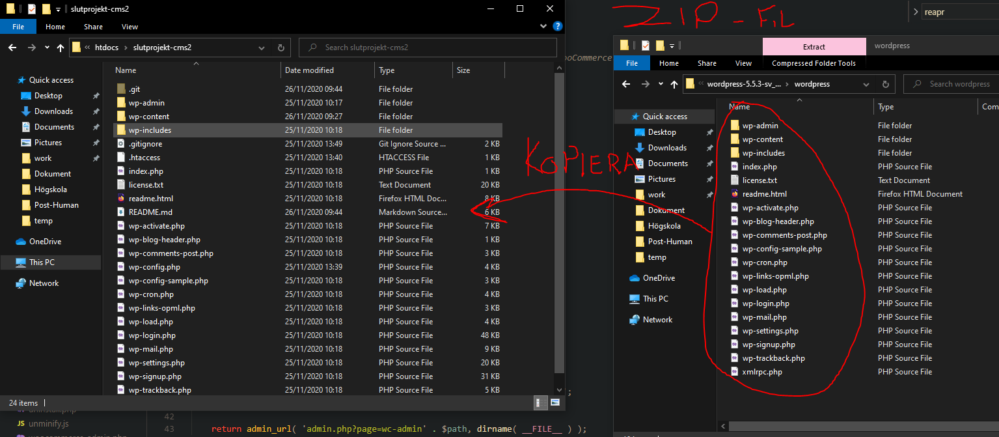
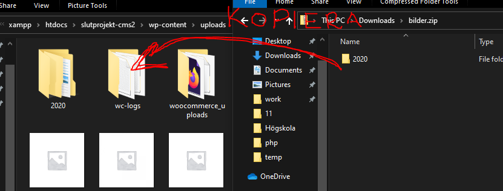

## Installation
1. Klona git repot
```
git clone git@github.com:vabrell/slutprojekt-cms2.git
```
2. Ladda ner [Wordpress](https://sv.wordpress.org/download/).
3. Öppna wordpress.zip filen som laddades ner, och gå in i wordpress mappen.
4. Kopiera filerna i wordpress mappen till _sluprojekt-cms2_ mappen du klonade, slå samman mappar i fall den frågar om det.
   
5. Installera __ACF Pro__ pluginet och aktivera det.
6. Installera __WooCommerce__ pluginet och aktivera det.
7. Aktivera __Slutprojekt CMS 2__ temat
8. Kopiera in bilderna i _wp-content/uploads_ mappen
	
9. Importera alla produkter med _produkter.csv_ filen.
10. Aktivera följande plugin
	* WooCommerce - Invoice payment
	* WooCommerce - Delivery Payment Gateway
	* Contact Form
	* Map